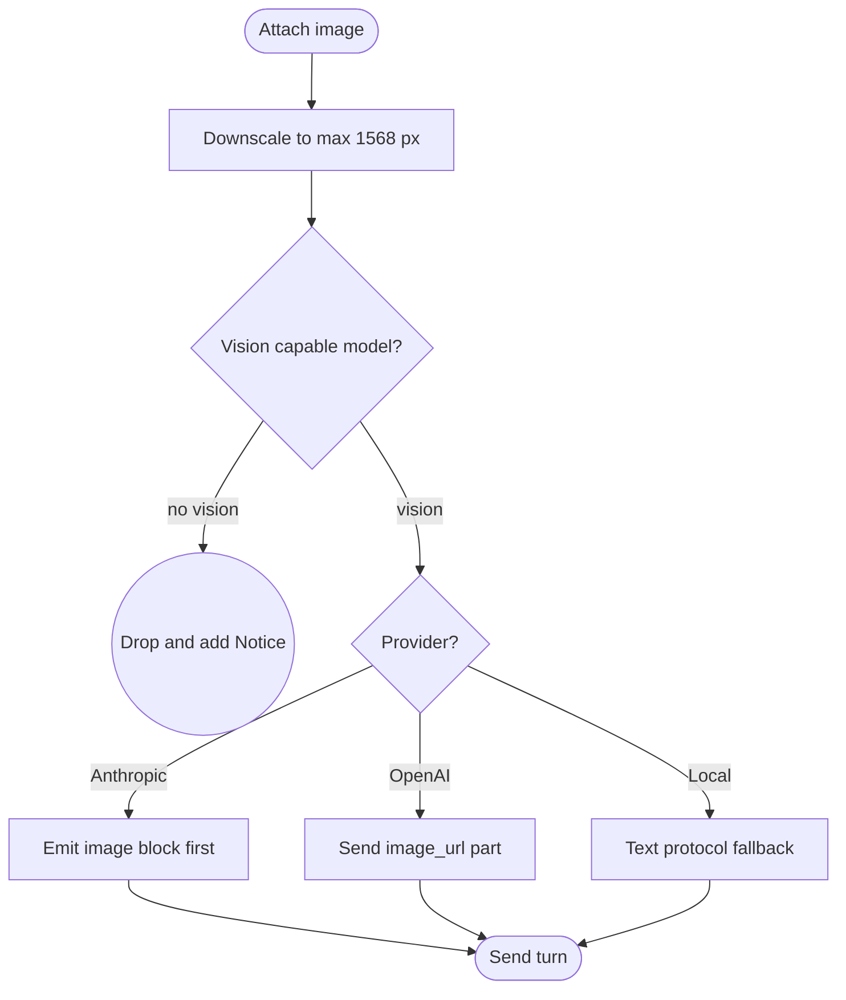

# Assistant Vision — Multimodal Image Input

The in-editor assistant can **send images to a vision-capable model**, not just read a JSON description of
the scene through a tool. This is the difference between "the snapshot tool says there are 3 cameras" and the
model actually *looking* at the Game view to reason about a visual bug, a UI layout, or a Figma-exported
mockup.

## Attaching an image

The composer has a **`＋ Image`** button beside *Add context*. It opens a menu of capture sources:

- **Scene View** — captures the last active Scene view camera.
- **Game View** — captures `Camera.main` (or the first active camera if none is tagged `MainCamera`).
- **Selected Texture** — attaches the currently selected texture asset (enabled only when a `Texture` is
  selected in the Project/Inspector).
- **Image File…** — pick a PNG/JPEG from disk.

Staged images appear as thumbnails above the context-chip row, each with a `×` to remove it. They're sent
with the **next** turn and cleared once it's sent. A turn may carry **only** images (empty message text is
allowed when at least one image is attached).

Every capture is **downscaled** so its longest edge is at most `AssistantImageCapture.MaxDimension` (1568 px,
matching vendor guidance) and re-encoded to PNG, so an oversized source can't bloat the request or the saved
session.

## Vision-capability gating

The `＋ Image` button is **disabled** unless the configured model can accept images
(`AssistantModelCatalog.IsVisionModel(provider, model)`, a conservative substring heuristic):

| Provider | Vision when the model id contains… |
|---|---|
| Anthropic | `claude-opus` / `claude-sonnet` / `claude-haiku` / `claude-fable` / `claude-3-5` / `claude-3-7` |
| OpenAI (& compatible) | `gpt-4o` / `gpt-4.1` / `gpt-5` / `gpt-4-vision` / `o3…` / `o4…` / `vision` / `-vl` |
| Local (Ollama) | `llava` / `vision` / `-vl` / `bakllava` / `moondream` / `minicpm-v` / `llama3.2-vision` / `qwen2-vl` / `qwen2.5-vl` / `gemma3` / `gemma4` |

Unknown → **not** vision, so a text-only model never receives an image that would `400` at the API. As a
safety net, if images are somehow attached to a non-vision model, the controller **drops them at send time**,
keeps the transcript marker, and adds a `Notice` turn explaining why — the turn still proceeds as text.

Add a new vision tag by extending the substring set in `AssistantModelCatalog.IsVisionModel`.

End to end, an attached image flows through downscaling and the vision-capability gate before splitting into the per-provider encoding branches:

## How it travels through the stack

- **Neutral model.** `LlmMessage` gains an ordered `Content` list of `LlmContentPart`; in current use the
  controller populates **image** parts only and leaves the message's visible text on `LlmMessage.Text` (the
  back-compat convenience every existing text-only path still relies on). `HasImages` reports whether any
  image part is present. Existing text-only turns and every persisted session are unchanged.
- **Anthropic.** Image parts translate to `image` content blocks (`source.type = base64`), emitted **before**
  the text block (Anthropic grounds better with images first).
- **OpenAI-compatible.** A multimodal user turn sends the content-parts array — a `text` part (when present)
  followed by one `image_url` part per image, each a `data:<media-type>;base64,…` URL. A text-only turn keeps
  the legacy string-content shape untouched.
- **Local / text-tool protocol.** Image parts survive the text-protocol history rebuild, so a local vision
  model (e.g. `llava`) still receives the attachment even though tool calls/results are rendered as text.

## Cost, persistence, and redaction

- **Billed.** Each image adds an estimated `~(w·h)/750` input tokens (clamped 85–4000;
  `AssistantCostTable.EstimateImageTokens`), folded into the composer's live context estimate and the session
  cost readout — a multimodal turn is never billed as if the image were free.
- **Persisted.** Image parts round-trip through the session file so a reloaded conversation keeps its visual
  context, **size-capped** (an oversized base64 payload is dropped from the *saved* copy — it was still sent
  live).
- **Redacted.** Image bytes never enter the visible transcript. The only trace is a compact marker on the
  user turn (`[1 image attached]` / `[N images attached]`), so copy/plain-text export can't leak the payload.

## Non-goals

Image **generation**/editing, video input, and OCR-as-a-tool are out of scope — this is
image *input* to the chat only.

## See also

- [Model & Provider Switcher](ASSISTANT_MODEL_SWITCHER.md)
- [Assistant Web Tools](ASSISTANT_WEB_TOOLS.md)
