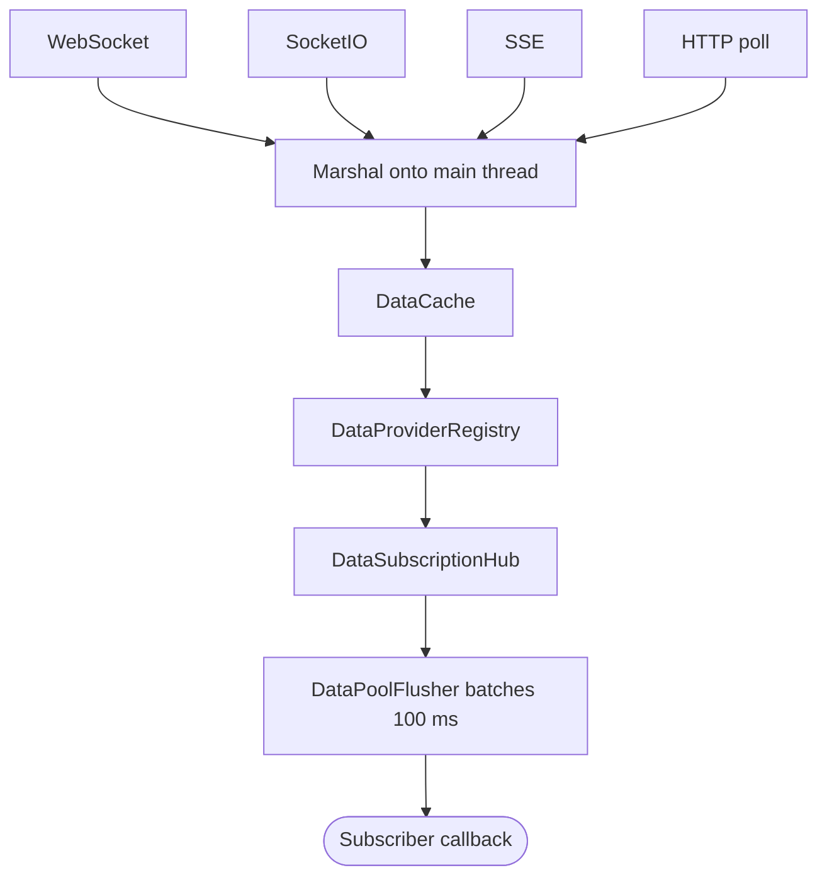

# Data Manager & Streaming Providers

Where [Networking](NETWORKING.md) covers request/response HTTP, the **Data** layer covers *live,
push-style* data: a `DataManager` subsystem fed by pluggable **providers** (WebSocket, Socket.IO,
Server-Sent Events, HTTP polling). Consumers subscribe to a `DataModel` and receive batches of
`ImmutableData` as they arrive — no polling, no manual field parsing.

## DataManager

`DataManager` is a `RuntimeSubsystem`. Resolve it the standard way, or use the convenience singleton
that simply forwards to `RuntimeManager.GetSubsystem<DataManager>()`:

```csharp
var data = DataManager.Instance;                 // == RuntimeManager.GetSubsystem<DataManager>()
```

Internally it is decomposed into three collaborators behind the facade — a **`DataProviderRegistry`**
(providers + their caches), a **`DataSubscriptionHub`** (subscriber lists), and a **`DataPoolFlusher`**
(batching) — but you interact only with the `DataManager` surface.

| Member | Purpose |
|---|---|
| `RegisterDataProvider(DataProvider)` / `UnregisterDataProvider(DataProvider)` | Add/remove a provider (and its cache). |
| `SubscribeToDataModel(DataModel, Action<ImmutableData[]>)` | Receive batched updates for a model. |
| `UnsubscribeFromDataModel(DataModel, Action<ImmutableData[]>)` | Remove a subscription. |
| `GetAllData(string providerId)` | `IReadOnlyList<ImmutableData>` currently cached for a provider. |
| `FetchData(providerId)` / `RefreshAllData()` | Trigger a one-off / global refresh. |
| `FlushAllDataPools()` / `FlushDataPoolManually(modelId)` | Force pending batches to flush now. |
| `HasActiveSubscriptions(DataModel)` | Diagnostics. |
| `OnDataProviderRegistered` / `OnDataProviderUnregistered` (static events) | Provider lifecycle. |

## Subscribing to a model

Subscriptions are keyed by a `DataModel` asset (its unique `ModelId` guarantees identity). Callbacks
receive an **array** of `ImmutableData` — the manager pools rapid updates and flushes them on an
interval (default 100 ms) so a burst of messages becomes one batched callback rather than many.

```csharp
public class TelemetryReadout : MonoBehaviour
{
    [SerializeField] private DataModel _sensorModel;

    private void Start() =>
        DataManager.Instance.SubscribeToDataModel(_sensorModel, OnSensorBatch);

    private void OnDestroy()
    {
        // Always unsubscribe — subscriptions hold a reference to your callback.
        if (DataManager.Instance != null)
            DataManager.Instance.UnsubscribeFromDataModel(_sensorModel, OnSensorBatch);
    }

    private void OnSensorBatch(ImmutableData[] batch)
    {
        foreach (var d in batch)
            if (d.IsValid && d.TryGet<float>("temperature", out var t))
                Debug.Log($"temp = {t}");
    }
}
```

`DataManager`/`DataCache` deal in whole `ImmutableData` records; you extract fields yourself with
`ImmutableData.TryGet<T>(fieldName, out value)`. Callbacks run **synchronously on the main thread**, so
touching Unity objects from them is safe.

## Providers

A provider is a `DataProvider` subclass that pulls or receives records and adds them to its cache. The
shipped transports live under `Runtime/Networking/Data/Provider/`:

| Provider | Transport | Notes |
|---|---|---|
| `WebSocketDataProvider` | WebSocket | Pumps messages from an `Awaitable` loop and dispatches on the main thread. |
| `SocketIODataProvider` | Socket.IO | Maps events; delivers via `OnUnityThread(...)`. |
| `SSEProvider` | Server-Sent Events | RFC-6502 stream parsing (`SSEEventStreamParser`). |
| `HttpDataProvider` | HTTP polling | Polls on an `Awaitable` loop. |

Each provider is paired (via a **Mapping**) with the `DataModel` it feeds, so incoming JSON is shaped
into `ImmutableData` records of a known structure.

Each transport marshals onto the main thread at its own boundary, then records flow through the cache, registry, hub, and batching flusher out to the subscriber:



## Reconnect & auth refresh

The streaming providers share a `StreamReconnectPolicy`: on a dropped connection they reconnect with
backoff and, where the endpoint is authenticated, re-fetch credentials before retrying (see
`AuthManager` in [Networking](NETWORKING.md)). Cancellation is honored through the subsystem's
`ShutdownToken`, so teardown unwinds any pending reconnect quietly.

## Threading boundary

This pipeline crosses real OS-thread boundaries, so it has one decided contract: **each provider
marshals onto the main thread at its own boundary, and every collaborator downstream — the cache, the
registry, the subscription hub, the flusher — may assume it is always called on the main thread.**
Socket.IO uses `OnUnityThread`; the WebSocket provider dispatches only inside its main-thread pump
loop; SSE and HTTP poll from `Awaitable` loops that are main-thread by construction. If you write a
custom provider, honor that boundary — do not invoke `DataManager` from a background thread. See the
threading section of the [Async Contract](ASYNC_CONTRACT.md) for the full rule.

## See also

- [Networking: HttpClient & Requests](NETWORKING.md)
- [Async Contract](ASYNC_CONTRACT.md)
- [Events](EVENTS.md)
- [Runtime Subsystems](SUBSYSTEMS.md)
