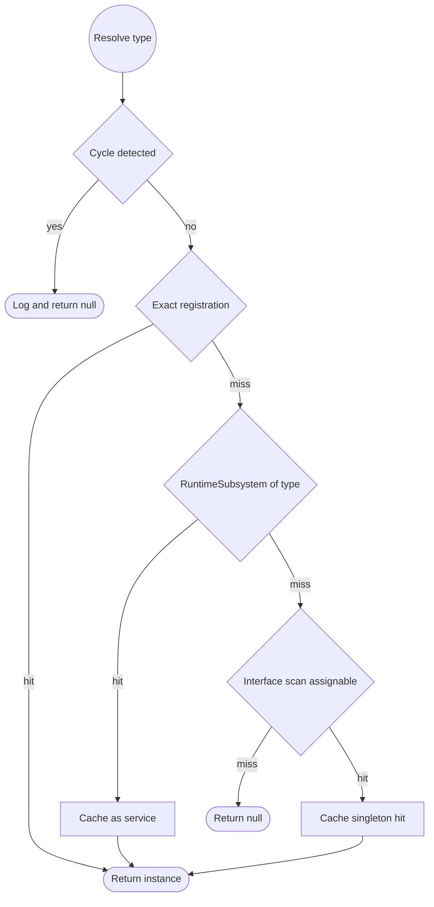

# Dependency Injection

Molca's DI container lives on `RuntimeManager`. You mark a field, property, or constructor with
`[Inject]` and the runtime resolves it from the same pool that answers `GetSubsystem<T>()` — every
subsystem, plus any service you register yourself. There is **no** `IInstaller`, `ServiceContainer`,
or `ServiceLocator` type; the whole surface is the static methods on `RuntimeManager` described below.

## The `[Inject]` attribute

`[Inject]` (in the `Molca` namespace, `Runtime/Attributes/InjectAttribute.cs`) can target a field, a
property, or a constructor. Fields and properties are the common case; a property must be writable
(a `private set` is fine, since injection goes through reflection).

```csharp
public class MyStep : Step
{
    [Inject] private EventDispatcher _events;          // field injection
    [Inject] private ReferenceManager _references;
    [Inject] public AudioManager Audio { get; private set; }  // property injection
}
```

| Attribute member | Default | Effect |
|---|---|---|
| `Required` | `true` | If the dependency can't be resolved, injection throws `MissingDependencyException`. |
| `ForceInject` | `false` | Inject even when the member already holds a usable value. |

Set them with the property-initializer syntax or the convenience constructor:

```csharp
[Inject(false)] private IAnalyticsService _analytics;        // optional — stays null if unregistered
[Inject(Required = false)] private ITelemetry _telemetry;    // same, explicit form
[Inject(ForceInject = true)] private EventDispatcher _bus;   // overwrite even a pre-set value
```

An optional dependency that can't be resolved is left null and resolves **without** a "service not
found" warning — staying null is its documented behavior. A destroyed `UnityEngine.Object` counts as
unset (Unity fake-null), so it is re-injected rather than treated as already populated.

## When injection happens

- **Scene MonoBehaviours** are injected automatically during bootstrap, after subsystems finish
  initializing and before `TypedEvents.ApplicationInitialized` is dispatched. Injection is isolated
  per object: one component with an unresolvable required dependency degrades only that component, it
  does not abort bootstrap.
- **Objects created after bootstrap** (spawned prefabs, `new`-ed helpers) are not caught by that pass —
  inject them yourself with one of the calls below.

Because scene injection runs late in bootstrap, never read an injected member before you have awaited
`RuntimeManager.WaitForInitialization()`.

### Injecting late-created objects

```csharp
// Inject into an object that already exists.
var helper = new MyHelper();
RuntimeManager.InjectDependencies(helper);

// Convenience overload typed for a MonoBehaviour.
RuntimeManager.InjectInto(someComponent);

// Create a pure C# class and inject it in one call (see Constructor injection).
var service = RuntimeManager.CreateWithInjection<MyService>();

// Timing-agnostic: inject now if the runtime is ready, otherwise queue for the bootstrap pass.
RuntimeManager.RegisterForAutoInjection(target);
```

For prefabs instantiated at runtime, add the `InjectOnAwake` component
(`Runtime/Runtime/InjectOnAwake.cs`): it waits for `RuntimeManager` readiness (opt-out via its
inspector toggle) and injects every component on the GameObject in `Awake`, so you don't wire an
injection call per spawn.

### Constructor injection (pure C# classes only)

`CreateWithInjection<T>()` picks the constructor marked `[Inject]`, or otherwise the one with the most
parameters, resolves each parameter from the container, then also injects any `[Inject]` fields and
properties. MonoBehaviours can't use constructor injection — Unity owns their construction — so use
field/property injection there.

```csharp
public class MyService
{
    private readonly EventDispatcher _events;

    [Inject]
    public MyService(EventDispatcher events) => _events = events;
}

var svc = RuntimeManager.CreateWithInjection<MyService>();
```

## Registering your own services

Subsystems register themselves automatically (by concrete type and by each non-framework interface
they implement), so you rarely register those by hand. For plain services you own three registration
methods, all main-thread-only and all callable only after the runtime is initialized:

```csharp
// Eager singleton — you supply the instance; shared for every resolve.
RuntimeManager.RegisterService<IMyService>(new MyServiceImpl());

// Lazy singleton — bind an interface to an implementation; instance created on first resolve.
RuntimeManager.BindService<IMyService, MyServiceImpl>();   // TImplementation needs a public parameterless ctor

// Transient — factory runs on every resolve, returning a fresh instance each time.
RuntimeManager.RegisterFactory<MyThing>(() => new MyThing());
```

| Method | Lifetime | Instance created | Notes |
|---|---|---|---|
| `RegisterService<T>(instance)` | Singleton | By you, up front | Registers under `T`; implementation type inferred. |
| `BindService<TInterface, TImpl>()` | Singleton | Lazily, on first resolve | `TImpl : class, TInterface, new()`. |
| `RegisterFactory<T>(factory)` | Transient | Every resolve | Factory delegate owns construction. |

Singleton services have their own `[Inject]` members populated exactly once, on first resolve;
transient instances are injected on every creation.

## Resolving

`[Inject]` resolves through the same path as an explicit lookup. Prefer `[Inject]`; reach for the
explicit calls in code that runs before injection or that resolves dynamically.

```csharp
var audio = RuntimeManager.GetService<AudioManager>();          // null (+warning) if unresolved
if (RuntimeManager.TryGetService<IMyService>(out var svc)) { }   // false if unresolved, no warning
bool has = RuntimeManager.HasService<IMyService>();
var sub = RuntimeManager.GetSubsystem<MySubsystem>();            // thin wrapper over GetService<T>
```

### Resolution order

For a requested type the container tries, in order:

1. An exact registration under that type (service, binding, or factory).
2. A `RuntimeSubsystem` of that type — resolved, then cached as a service for next time.
3. A linear scan for any registration whose implementation type is assignable to the requested type
   (interface fallback); a singleton hit is cached under the requested type so the scan runs once.

Resolution is re-entrancy guarded: a cycle (A needs B needs A) is detected and logged rather than
overflowing the stack, and the resolve returns null.

How the container resolves a requested type, in order, with the cycle guard short-circuiting to null:



## Failure modes

- A **required** dependency that can't be resolved makes `InjectDependencies` throw
  `MissingDependencyException` (`Runtime/Runtime/MissingDependencyException.cs`), naming the target
  type and every unresolved member. Failing fast at the injection site beats a downstream
  `NullReferenceException` at first use.
- DI mutation and injection are **main-thread-only**. A registration or injection call from a
  background thread (easy to hit from a network continuation) is logged and ignored — the container's
  collections and the per-type injection-plan cache are not thread-safe.

## See also

- [RuntimeManager](RUNTIME_MANAGER.md)
- [Subsystems](SUBSYSTEMS.md)
- [Attributes](ATTRIBUTES.md)
- [Async Contract](ASYNC_CONTRACT.md)
