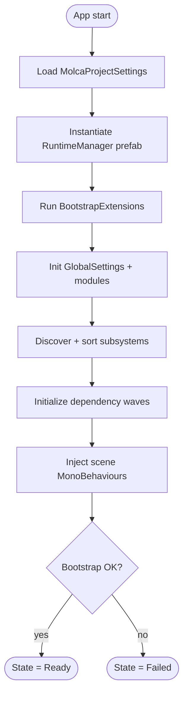

# Runtime Manager & Bootstrap

`RuntimeManager` is the application's single entry point. It boots itself automatically, brings every
`RuntimeSubsystem` online in dependency order, wires up dependency injection, and owns every object
that must outlive a scene load. You never instantiate it, and you never call `DontDestroyOnLoad`
yourself — you *wait for it* and then ask it for things.

## How bootstrap starts

`RuntimeManager` is a `MonoBehaviour` that starts itself from `[RuntimeInitializeOnLoadMethod]` — there
is no `RuntimeManager` in your scenes and nothing to place. On the first scene load it:

1. Loads `MolcaProjectSettings` (from Addressables) and instantiates the RuntimeManager prefab named
   there, then calls `DontDestroyOnLoad` on it — **the framework owns persistence, so consumer code
   never calls `DontDestroyOnLoad`**.
2. Runs any configured `BootstrapExtension` assets in list order (awaited).
3. Initializes `GlobalSettings` and loads all setting modules.
4. Discovers subsystems, sorts them by `[DependsOn]`, and initializes them in dependency waves.
5. Injects `[Inject]` members into every scene `MonoBehaviour`, then flushes anything queued for
   auto-injection.
6. Sets `IsReady`, moves `State` to `Ready`, and dispatches the `ApplicationInitialized` event.



The current phase is exposed as `RuntimeManager.State` (`BootstrapState`):

| `BootstrapState` | Meaning |
|---|---|
| `NotStarted` | No RuntimeManager exists yet (or it was shut down). |
| `Initializing` | Bootstrap is running; subsystems are coming online. |
| `Ready` | Bootstrap finished; `IsReady` is `true`; safe to access services. |
| `Failed` | Bootstrap aborted. `WaitForInitialization()` throws instead of hanging forever. |

## Waiting for the runtime — `WaitForInitialization()`

Injected fields and subsystems are only guaranteed populated after bootstrap completes, which happens
*after* `Awake`. Always await the runtime at the top of `Start()` before touching anything the runtime
provides:

```csharp
using Molca;
using Molca.Events;
using UnityEngine;

// Assets/YourProject/Scripts/ — plain scene MonoBehaviour.
public class MyComponent : MonoBehaviour
{
    [Inject] private EventDispatcher _events;

    private async void Start()
    {
        // Idempotent; safe to call even after bootstrap is complete.
        await RuntimeManager.WaitForInitialization();

        // _events and any GetSubsystem<T>() call are safe from here on.
        _events.DispatchEvent(EventConstants.SomeEvent);
    }
}
```

- `WaitForInitialization()` is **idempotent** — awaiting it after readiness returns immediately.
- An overload takes a `CancellationToken` (pass your `destroyCancellationToken`) and throws
  `OperationCanceledException` if the wait is cancelled.
- If bootstrap has `Failed`, `WaitForInitialization()` throws `InvalidOperationException` rather than
  waiting forever — surface it, don't retry in a loop.
- Never read injected fields or call `GetSubsystem<T>()` in `Awake()`; the runtime is not ready yet.

## Subsystem discovery and registration

Subsystems come online two ways:

- **Child components** — a `RuntimeSubsystem` placed on (or under) the RuntimeManager prefab is
  discovered automatically. This is the normal path: add your subsystem as a child component, no
  registration code required. Only enabled components are considered.
- **External registration** — `await RuntimeManager.RegisterSubsystem(subsystem)` brings up a subsystem
  that lives outside the prefab hierarchy after bootstrap; `DeregisterSubsystem(subsystem)` removes and
  shuts one down.

Duplicate types are collapsed: if two instances of the same subsystem type are discovered, the first is
kept and the rest are dropped with a warning. Once initialized, each subsystem is registered in the
service container under its concrete type **and** its non-generic interfaces, so `GetSubsystem<T>()`,
`GetService<T>()`, and `[Inject]` all resolve it.

For introspection, `GetSubsystems()` returns a snapshot in discovery order and `GetResolvedInitOrder()`
returns the order bootstrap actually used.

## Ordering with `[DependsOn]`

Apply `[DependsOn(typeof(OtherSubsystem))]` when your subsystem uses another subsystem inside its
initialization. Bootstrap builds a directed graph from these declarations, topologically sorts it, and
groups subsystems into **dependency waves** — every member of a wave depends only on earlier waves, and
each wave is fully awaited before the next launches. So a `[DependsOn]` target is guaranteed
initialized by the time your subsystem's own initialization runs.

```csharp
// Assets/YourProject/Scripts/Subsystems/ — base class RuntimeSubsystem.
// Added as a child component on the RuntimeManager prefab.
[DependsOn(typeof(LogManager))]
public class TelemetrySubsystem : RuntimeSubsystem
{
    [Inject] private LogManager _log;   // resolved before InitializeAsync runs

    public override async Awaitable InitializeAsync(System.Threading.CancellationToken ct)
    {
        _log.LogInfo("Telemetry online");   // _log is guaranteed initialized here
        await Awaitable.NextFrameAsync();
    }
}
```

- Multiple `[DependsOn]` attributes may decorate one type, and each may list several types.
- Dependency types may be concrete subsystems or interfaces — matching uses `IsInstanceOfType`.
- Without `[DependsOn]`, ordering falls back to `InitializationPriority` (a serialized `int`; **higher
  initializes earlier**). It is also the tiebreaker among subsystems unrelated in the graph.
- **Cycles are detected at boot.** On a cycle, RuntimeManager logs an error naming the participants and
  falls back to `InitializationPriority`-only order so the app still boots — fix the declaration to
  clear the error.
- Each subsystem's initialization is awaited up to a 20-second timeout; a subsystem that overruns is
  cancelled and marked failed so bootstrap can continue rather than soft-locking.

Shutdown walks the resolved init order in **reverse** (LIFO), so declaring `[DependsOn]` correctly also
makes teardown order predictable.

## Resolving services at runtime

Once the runtime is ready, resolve subsystems and services through `RuntimeManager` — never
`FindObjectOfType<T>()` and never a static singleton:

```csharp
// Subsystem access (auto-registered child or externally registered subsystem).
var telemetry = RuntimeManager.GetSubsystem<TelemetrySubsystem>();

// Service container.
var foo = RuntimeManager.GetService<IFoo>();               // null if not found (logs a warning)
if (RuntimeManager.TryGetService<IFoo>(out var svc)) { }   // no warning, no exception
bool has = RuntimeManager.HasService<IFoo>();

// Manual registration (main thread only, after readiness).
RuntimeManager.RegisterService<IFoo>(new FooImpl());       // eager singleton instance
RuntimeManager.BindService<IFoo, FooImpl>();               // lazy singleton (created on first resolve)
RuntimeManager.RegisterFactory<IFoo>(() => new FooImpl()); // transient — new instance per resolve
```

`GetSubsystem<T>()` is a thin wrapper over `GetService<T>()`; both flow through the same container.
`RuntimeManager` itself is *not* a subsystem — don't try to register it.

## Injecting late-spawned objects

The automatic injection pass only covers objects present when bootstrap runs. For objects you spawn
later, populate their `[Inject]` members explicitly:

```csharp
// Synchronous — the runtime must already be ready.
RuntimeManager.InjectDependencies(obj);

// Timing-agnostic — inject now if ready, otherwise queue and inject during the readiness step.
RuntimeManager.RegisterForAutoInjection(obj);

// Construct a pure C# object with constructor + member injection in one call.
var service = RuntimeManager.CreateWithInjection<MyService>();
```

Prefer `RegisterForAutoInjection` from factories or scene scripts that may run during `Awake` — before
the automatic scene pass — for a single call site that works whatever the timing. A required
dependency (`[Inject]` with `Required = true`) that cannot be resolved throws `MissingDependencyException`
at the injection site; optional injections (`[Inject(false)]`) stay `null` silently.

## Bootstrap extensions

To run layer- or project-specific setup *before* any subsystem initializes — without subclassing
`MolcaProjectSettings` — subclass `BootstrapExtension` and add the asset to
`MolcaProjectSettings.BootstrapExtensions`:

```csharp
// SDK/project layer — base class BootstrapExtension (a ScriptableObject).
[CreateAssetMenu(menuName = "Molca/Bootstrap/VR Extension")]
public class VRBootstrapExtension : BootstrapExtension
{
    public override async Awaitable OnBootstrap(MolcaProjectSettings projectSettings)
    {
        // Load addressables, prepare the environment, etc. Awaited before subsystems init.
        await Awaitable.NextFrameAsync();
    }
}
```

Extensions run sequentially in list order; one that throws is logged and skipped without blocking the
rest of bootstrap.

## See also

- [Subsystems](SUBSYSTEMS.md)
- [Dependency Injection](DEPENDENCY_INJECTION.md)
- [Async Contract](ASYNC_CONTRACT.md)
- [Events](EVENTS.md)
- [Getting Started](GETTING_STARTED.md)
