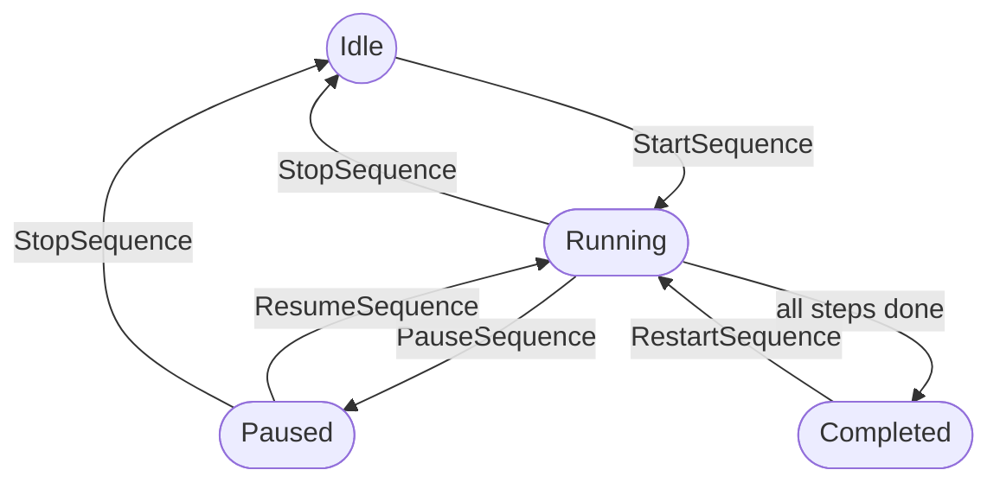
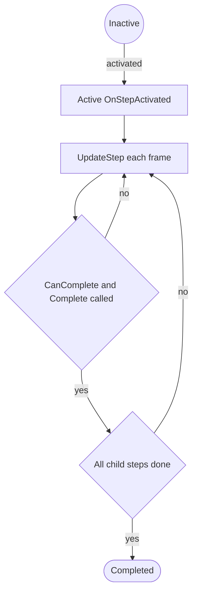

# Sequences: Controller, Steps & Auxiliaries

A **sequence** is a training or workflow procedure driven at runtime by a `SequenceController`. The
controller advances through `Step` components in its child hierarchy, and each step can carry
`StepAuxiliary` behaviors for cross-cutting concerns. This guide covers the runtime API and lifecycle —
for building sequences from a spec and validating them, see the authoring and validation guides.

## SequenceController

`SequenceController` (`MonoBehaviour`, implements `IReferenceable<SequenceController>`) is placed once on
a root GameObject; every `Step` in its children belongs to it. It is registered with the
`ReferenceManager` under its `RefId` (the serialized `sequenceId`), so you resolve it the same way as any
other scene object — via a `SceneObjectReference` or `ReferenceManager`, never `FindObjectOfType`.

On `Start` it awaits `RuntimeManager.WaitForInitialization`, injects its dependencies, registers itself,
then discovers every active, enabled `Step` under it (`GetComponentsInChildren<Step>`). No manual step
registration is needed.

### State machine

`CurrentState` is a `SequenceState`: `Idle`, `Running`, `Paused`, or `Completed`. Convenience flags
`IsRunning`, `IsPaused`, and `IsActive` read off it.



### Driving a sequence

| Member | Purpose |
|---|---|
| `StartSequenceAsync(CancellationToken)` | Awaitable start; waits for the runtime and for steps to populate, then activates the first step. Re-entrant calls are ignored while starting or running. |
| `StartSequence()` | `async void` inspector/UnityEvent shim over `StartSequenceAsync` (owns its exceptions). |
| `CompleteCurrentStep()` | Marks `CurrentStep` complete — wire this to a UnityEvent when a user action fulfills the step. |
| `PauseSequence()` / `ResumeSequence()` | Pause/resume; propagate to the current step and its auxiliaries. |
| `StopSequence()` | Return to `Idle` and deactivate the current step. |
| `RestartSequence()` | `StopSequence()` then `StartSequence()`. |

Set `AutoStart` (with `AutoStartDelay`) to start automatically after bootstrap.

### Observing progress

`CurrentStep` and the read-only `Steps` list expose the run. Subscribe to the controller's `UnityEvent`
fields — `OnSequenceStart`, `OnSequenceFinish`, `OnSequencePause`, `OnSequenceResume`, and
`OnStepChanged(Step)` — from the Inspector or code. `SequenceStartTime`, `SequenceFinishTime`, and
`TimeTaken` record timing. When a `TelemetrySubsystem` is present, the controller also emits
`sequence.*` telemetry automatically (and runs unchanged when it is absent).

```csharp
[SerializeField] private SceneObjectReference sequenceRef;

private void BeginTraining()
{
    var controller = sequenceRef.Resolve<SequenceController>();
    controller.OnSequenceFinish.AddListener(OnTrainingDone);
    controller.StartSequence();
}
```

## The Step lifecycle

`Step` (`MonoBehaviour`, `IReferenceable<Step>`) is a single unit of work. Its runtime `CurrentStatus` is
a `StepStatus`: `Inactive`, `Active`, or `Completed`.



Steps nest by GameObject hierarchy. A step is **internally** complete once its own condition is met
(`IsInternallyCompleted`), but **fully** complete (`IsCompleted`) only when it is internally complete
*and* all direct children are complete. The controller advances through siblings and descends into
children accordingly.

### Overridable methods

| Method | Kind | When it runs |
|---|---|---|
| `OnStepActivated()` | `protected virtual` | Step becomes active — resolve references, subscribe, reset state |
| `UpdateStep()` | `public virtual` | Every frame while active — poll input, tick timers, call `Complete()` |
| `OnStepDeactivated()` | `protected virtual` | Step leaves the active state — unsubscribe, clean up |
| `OnStepCompleted()` | `protected virtual` | Internal condition accepted as complete |
| `CanComplete()` | `protected virtual` | Gate consulted by `Complete()`; return `false` to block completion |
| `OnStepPaused()` / `OnStepResumed()` | `protected virtual` | Sequence paused / resumed while this step is active |
| `GetCompletionBlockReason()` | `public virtual` | Optional human-readable reason a step can't complete yet (for tooling) |

All are `protected virtual` **except `UpdateStep()`, which is `public virtual`** — override it with
`public override` and call `base.UpdateStep()` so attached auxiliaries still receive `OnStepUpdate()`.

### Completing a step

Call `Complete()` to signal the step's work is done. It is gated by `CanComplete()` — if that returns
`false` the call is a no-op. The step then reaches full completion only once its children are also
complete. `ForceComplete()` bypasses the `CanComplete()` gate (use sparingly; authoring/editor paths
only). Completion dispatches `EventConstants.Sequence.StepCompleted` and, when fully complete,
`StepFullyCompleted` — both carry the `Step` as data (see [Events](EVENTS.md)).

### Writing a custom step

Place custom steps in `Assets/YourProject/Scripts/Steps/`, subclass `Step`, and name them `[Noun]Step`.
Add the component under a `SequenceController` in the scene — no registration code.

```csharp
// Assets/YourProject/Scripts/Steps/PressButtonStep.cs

/// <summary>Completes when the user holds the referenced button for the configured duration.</summary>
/// <remarks>
/// The target needs a <see cref="ReferenceableComponent"/> whose Ref Id matches
/// <see cref="_buttonRef"/>. Main thread only.
/// </remarks>
public class PressButtonStep : Step
{
    /// <summary>Reference to the interactable button in the scene.</summary>
    [SerializeField] private SceneObjectReference _buttonRef;

    /// <summary>Minimum hold time in seconds before the step completes.</summary>
    [SerializeField] private float _holdDuration = 2f;

    private MyButton _button;
    private float _holdTimer;

    protected override void OnStepActivated()
    {
        _button = _buttonRef.Resolve<MyButton>();
        _holdTimer = 0f;
    }

    public override void UpdateStep()
    {
        base.UpdateStep();                       // keeps auxiliaries ticking
        if (_button != null && _button.IsPressed)
        {
            _holdTimer += Time.deltaTime;
            if (_holdTimer >= _holdDuration) Complete();
        }
    }

    protected override bool CanComplete() => _holdTimer >= _holdDuration;

    protected override void OnStepDeactivated() => _button = null;
}
```

> Steps are components, not services: never resolve them through `RuntimeManager.GetSubsystem<T>()` or
> `FindObjectOfType`. If a subclass needs its own `OnDestroy`, override the base one and call
> `base.OnDestroy()` so the step still unregisters from the `ReferenceManager`.

### Built-in step types

Core ships these; check them (and your SDK layer) before writing a new type.

| Type | Purpose |
|---|---|
| `DelayStep` | Wait for a fixed duration |
| `ConditionalStep` | Complete when a condition becomes true |
| `ParallelStep` | Activate direct children together; completes when all are done (children finish in any order) |
| `BranchingStep` | Activate one branch based on a condition |
| `AnimationStep` | Complete when an animation state finishes |
| `IntCounterStep` | Complete when an integer counter reaches a target |
| `FloatListenerStep` | Complete when a float value crosses a threshold |
| `InputStep` | Complete on a configured input action |

## Step auxiliaries

`StepAuxiliary` is a modular behavior attached *inside* a `Step` — a plain `[Serializable]` C# class
(**not** a MonoBehaviour), serialized in the step's auxiliary list via `[SerializeReference]`. Use one for
a cross-cutting concern (audio, screenshots, timers, hints, toggles) that shouldn't be baked into a
specific step subclass. The step drives every auxiliary's lifecycle in lockstep with its own.

### Lifecycle callbacks

Callbacks are **parameterless** — the owning step is exposed on the base as properties, not passed in.

| Method | Kind | When it runs |
|---|---|---|
| `OnInitialize()` | `protected virtual` | Once, after `Step`/`gameObject` are bound — do resolution work here |
| `OnStepBegin()` | `public abstract` | Step becomes active — **must override** |
| `OnStepCompleted()` | `public abstract` | Step's internal objective completes — **must override** |
| `OnStepEnd()` | `public virtual` | Step becomes inactive (cancelled, skipped, or reset) |
| `OnStepReset()` | `public virtual` | Step reset to initial state |
| `OnStepPause()` / `OnStepResume()` | `public virtual` | Sequence paused / resumed while active |
| `OnStepUpdate()` | `public virtual` | Every frame while the step is active |
| `OnRemoved()` | `public virtual` | Auxiliary removed — clears the owner references |

> The auxiliary pause/resume hooks are imperative — `OnStepPause` / `OnStepResume` — unlike the step's
> own `OnStepPaused` / `OnStepResumed`. The base is already `[Serializable]`; subclasses don't re-declare
> it. All callbacks are guarded by the step, so a throwing auxiliary is logged and never aborts the step.

### Accessing the owning step

Bound during initialization and available in every callback:

- `Step Step` — the owning step; `GameObject gameObject` — its GameObject.
- `bool IsEnabled` / `bool IsActive` (enabled **and** initialized); `SetEnabled(bool)` toggles at runtime.
- Helpers: `GetComponent<T>()`, `GetComponents<T>()`, `FindChild(name)`, `FindChildRecursive(name)`.

### Writing a custom auxiliary

Place custom auxiliaries in `Assets/YourProject/Scripts/Auxiliaries/`, subclass `StepAuxiliary`, and name
them `[Feature]Auxiliary`. The optional `[AuxiliaryMenu("Category/Name")]` attribute adds it to a step's
"Add Auxiliary" menu (pass `allowMultiple: true` to permit more than one per step).

```csharp
// Assets/YourProject/Scripts/Auxiliaries/ScreenshotAuxiliary.cs

/// <summary>Captures a screenshot when the step's objective completes.</summary>
[AuxiliaryMenu("Base/Screenshot")]
public class ScreenshotAuxiliary : StepAuxiliary
{
    [SerializeField] private string _outputFolder = "Screenshots";

    protected override void OnInitialize()
    {
        // Step and gameObject are bound here — resolve subsystems / cache components.
    }

    public override void OnStepBegin() { }        // required override

    public override void OnStepCompleted()        // required override
    {
        Capture(Step.name);                        // owning step via the property
    }

    private void Capture(string stepName) { /* ... */ }
}
```

### Attaching and managing auxiliaries

Auxiliaries are added in the Inspector through the step's "Add Auxiliary" menu (populated by
`[AuxiliaryMenu]`) — no code wiring. From code, a step also exposes `AddAuxiliary`, `RemoveAuxiliary`,
`RemoveAuxiliaryAt`, `GetAuxiliary<T>()`, `HasAuxiliary<T>()`, and the read-only `Auxiliaries` list.
Core ships `StepAudioPlayer`, `StepComponentToggler`, `StepGameObjectToggler`, `StepTransformController`,
`StepDebugLogger`, and `StepInfo` — check these before writing a new one.

### Auxiliary vs subclass

| Use an auxiliary | Use a step subclass |
|---|---|
| Behavior applies to many different step types | Behavior is specific to one step's domain |
| You cannot modify the target step class | You own the step and it's tightly coupled |
| Cross-cutting concern (audio, logging, toggles) | Core completion logic variation |

## See also

- [Sequence Authoring (Spec→Sequence)](SEQUENCE_AUTHORING.md)
- [Sequence Validation](SEQUENCE_VALIDATION.md)
- [Reference System](REFERENCE_SYSTEM.md)
- [Events](EVENTS.md)
