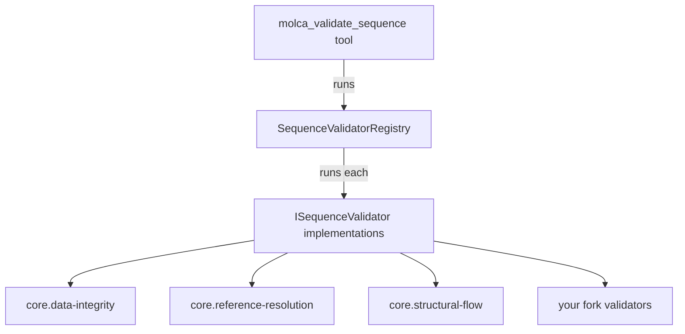
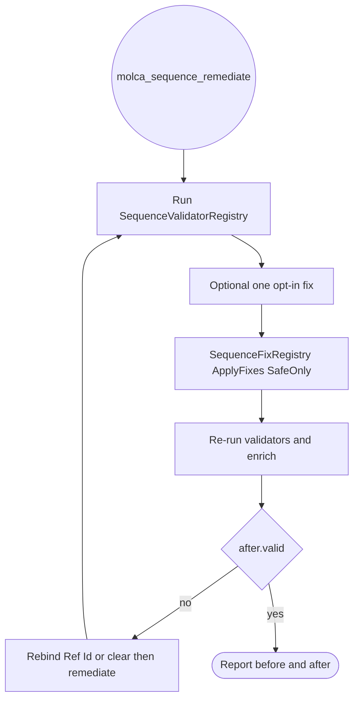

# Sequence Validation

Molca Core validates a `SequenceController` at **author time** through a pluggable registry of
`ISequenceValidator` implementations. Core ships the backend-agnostic checks; SDK forks add their own
domain validators without modifying Core. The `molca_validate_sequence` MCP tool runs the whole
registry and returns the merged findings.

> **Layer discipline.** Core knows `SequenceController`, `Step`, `StepAuxiliary`, and Ref Id — it does
> **not** know the word "scenario", a spec, or any backend. Anything domain-specific
> (scenario-coverage-vs-spec, backend-upload-contract) is an **SDK-layer** validator that plugs into the
> registry. The registry exists precisely so those can be added without a Core edit.

## How it fits together



`SequenceValidatorRegistry` discovers validators by `TypeCache`, dedups them by `Id`, orders them, and isolates a throwing validator into a single `ValidatorError` finding.

### Relationship to the legacy `SequenceValidator`

The static `Molca.Editor.SequenceValidator` is **not replaced**. It still directly drives
the sequence visualizer, the graph editor node badges, the step importer dry-run, and the
`molca_sequence_fix` auto-fix tools, and it owns the auto-fix logic. The registry simply **wraps** it:
the `core.data-integrity` validator runs it and maps each of its findings into the merged report, so
those findings (broken auxiliaries, empty/duplicate Ref Ids, inactive-parent-with-active-children) appear
alongside the newer checks. No legacy consumer changed.

## The built-in validators

| Id | Checks |
|---|---|
| `core.data-integrity` | Broken auxiliaries, empty/duplicate step Ref Ids, disabled parents gating active children (auto-fixable via `molca_sequence_fix`). |
| `core.reference-resolution` | Every outbound `SceneObjectReference` on a step or its auxiliaries resolves to exactly one `IReferenceable` in the loaded scene(s); flags unresolved (Error), ambiguous, or type-mismatched (Warning). |
| `core.structural-flow` | Control-flow topology over the graph editor's derived flow edges: empty `Parallel`/`Branching`/`Conditional` containers, degenerate single-option branches, and steps detached from the flow. |

### Editor-time resolution, not `ResolveAsync`

The `core.reference-resolution` validator resolves references with a single **scene scan**, never
`SceneObjectReference.ResolveAsync<T>`. `ResolveAsync` waits on **runtime** `ReferenceManager`
registration and cannot run in edit mode, so it is unusable for author-time validation.

### Structural checks reuse the graph editor's edges

The runtime sequence model has **no persisted edges** — advancement is the transform hierarchy plus step
subclasses (`ParallelStep`, `BranchingStep`, `ConditionalStep`). The `core.structural-flow` validator
therefore reasons over the **derived** flow edges — the same edge model the graph editor draws. The
validator and the visual graph can never disagree, and branch /
parallel semantics are correct for free (a branch's children are mutually-exclusive fan-out edges, not an
all-must-complete chain). A runtime edge model is deliberately **not** introduced.

## Adding a validator in a fork

Drop a parameterless class implementing `ISequenceValidator` anywhere in an editor assembly — the
registry discovers it by `TypeCache`, no registration line:

```csharp
using System.Collections.Generic;
using Molca.Editor.Validation;

namespace MyForkSdk.Editor.Validation
{
    /// <summary>Every step that maps to a spec procedure step must carry a non-empty procedure id.</summary>
    public sealed class ScenarioCoverageValidator : ISequenceValidator
    {
        public string Id => "vr.scenario-coverage";
        public string Description => "Each step is covered by the linked procedure spec.";

        public IEnumerable<SequenceValidationFinding> Validate(SequenceValidationContext context)
        {
            foreach (var step in context.Steps)
            {
                // ... fork-specific spec lookup ...
                if (/* step not covered by the spec */ false)
                {
                    yield return new SequenceValidationFinding(
                        Id, "UncoveredStep", SequenceValidationSeverity.Warning,
                        $"Step '{step.name}' has no matching procedure step in the spec.", step);
                }
            }
        }
    }
}
```

Rules:

- **Unique `Id`** (e.g. namespaced `vr.*`). The registry rejects a duplicate id loudly and skips it.
- **Editor-time only.** No `ResolveAsync`, no play-mode assumptions. Resolve references via
  `context.ResolveRefId(refId)`.
- **Return, don't throw.** A validator that throws is isolated — the registry logs it and surfaces a
  single `ValidatorError` finding rather than aborting the whole run — but returning findings is the
  contract.
- **Severity** is `Info` / `Warning` / `Error`. The report's `valid` flag is "no `Error`".

## The MCP tool output

`molca_validate_sequence` returns (additive keys preserve the legacy shape):

```jsonc
{
  "controller": "MyController",
  "controllerRefId": "ctrl-1",
  "stepCount": 12,
  "findingCount": 2,
  "errorCount": 1,
  "warningCount": 1,   // additive
  "valid": false,       // additive — errorCount == 0
  "findings": [
    {
      "type": "UnresolvedReference",   // legacy key; equals "category"
      "category": "UnresolvedReference", // additive
      "validator": "core.reference-resolution", // additive
      "severity": "Error",
      "message": "...",
      "stepRefId": "step-3",
      "stepName": "Open Valve",
      "auxiliaryIndex": -1,
      "hasFix": false
    }
  ],
  "steps": [ /* full step tree — unchanged */ ]
}
```

See [`MCP_FORK_PROVIDERS.md`](./MCP_FORK_PROVIDERS.md) for the MCP provider/tool fork pattern, and
[`SEQUENCE_AUTHORING.md`](./SEQUENCE_AUTHORING.md) for `molca_sequence_author` (declarative whole-graph
authoring that applies a plan and converges it through this gate).

## Remediation

Validation findings are made **actionable** by a parallel fix registry. `molca_sequence_remediate`
composes the loop: run the validators, apply fixes, re-validate, report before/after.



### Fix facets &amp; remediation policy

A fix is **not** a single "safe" bool. It describes itself on three orthogonal facets (extend
`SequenceValidatorFixBase`, which defaults them to deterministic / non-destructive / `UnityUndo`):

- **`IsDeterministic`** — needs no caller input (so a blanket pass can apply it).
- **`IsDestructive`** — discards data.
- **`Reversibility`** — `UnityUndo` / `FileSnapshot` / `Irreversible`.

A blanket pass selects fixes by a `RemediationPolicy` computed from those facets, not a self-declared flag:

| Policy | Applies |
|---|---|
| `SafeOnly` (default) | deterministic ∧ non-destructive ∧ `UnityUndo` |
| `DeterministicReversible` | deterministic ∧ revertible (Unity-Undo or file-snapshot) |
| `All` | every deterministic fix |

The built-ins:

| Id | Deterministic | Destructive | Reversibility | Handles |
|---|---|---|---|---|
| `core.legacy-autofix` | ✅ | ✕ | `UnityUndo` | `EmptyRefId`, `DuplicateRefId`, `InactiveParentWithActiveChildren` (delegates to the shipped auto-fix) |
| `core.broken-auxiliary-fix` | ✕ (needs `newType`) | ✕ | `FileSnapshot` | `BrokenAuxiliary` (rewrites scene YAML; snapshotted for revert via `molca_undo_last_action`) |
| `core.clear-broken-reference` | ✅ | ✅ | `UnityUndo` | `UnresolvedReference` (unsets the broken reference) |

Only `core.legacy-autofix` is picked by `SafeOnly`; the destructive clear-fix and the parameterized
aux-fix must be requested explicitly via the tool's `fix` argument. A discovery-time **coherence guard**
flags any fix declared both destructive and `Irreversible`.

### Revert honesty

`molca_sequence_remediate` never silently spans two revert mechanisms. Applied fixes are grouped by
`Reversibility` and reported in a `reverts[]` array (`{mechanism, handle, description}`) — a `UnityUndo`
phase (Ctrl+Z) and any `FileSnapshot` phase (restore the scene snapshot) are listed separately, so the
caller always knows what a single "undo" covers. (A future single transactional revert across both is
the eventual end state.)

### References are suggestion-driven, not blind-fixed

Suggestions are computed **on demand**, not by the validator — the `core.reference-resolution` pass
stays cheap and pure. A separate `ISequenceFixSuggester` (discovered by `TypeCache`) computes the nearest
existing Ref Ids by Levenshtein distance, and the report assembly attaches `Suggestions`/`FixHint` to
findings when the validate/remediate tools build their report. The gate never guesses which object was
meant. The convergence loop:

1. `molca_validate_sequence` (or `molca_sequence_remediate`) → surfaces unresolved references with suggestions.
2. The agent rebinds to the right Ref Id via `molca_sequence_set_step_fields` / `molca_sequence_set_auxiliary_fields`.
3. Re-run `molca_sequence_remediate` (safe pass) → repeat until `after.valid` is true.

When no target is correct, the agent can clear it (`fix.category=UnresolvedReference`, opt-in, destructive).

> **`molca_sequence_fix`** is retained for back-compat (single broken-aux + `fixAll`) but is now a thin
> subset routed through the same `SequenceFixRegistry` (its `fixAll` *is* the `SafeOnly` pass). Prefer
> `molca_sequence_remediate` for the full loop.

### Adding a fix in a fork

Extend `SequenceValidatorFixBase` (overriding only the facets that differ) and key it to your validator's
finding categories — discovered by `TypeCache`, no registration line:

```csharp
public sealed class RebindToCanonicalProcedureFix : SequenceValidatorFixBase
{
    public override string Id => "vr.rebind-procedure";
    public override string Description => "Rebinds an uncovered step to its canonical procedure step.";
    public override bool IsDestructive => true; // changes meaning — excluded from SafeOnly
    public override IReadOnlyCollection<string> HandledCategories => new[] { "UncoveredStep" };

    public override SequenceFixOutcome Apply(SequenceValidationFinding finding, SequenceValidationContext ctx, JObject args)
    {
        // ... fork-specific rebind, via Undo ...
        return new SequenceFixOutcome(true, "Rebound to procedure step.");
    }
}
```

A fork can likewise add an `ISequenceFixSuggester` to propose domain-specific remediations for its own
finding categories.

## See also

- [Sequence Authoring](SEQUENCE_AUTHORING.md)
- [Extending MCP from a Fork](MCP_FORK_PROVIDERS.md)
