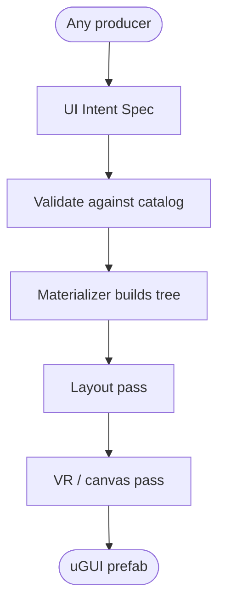

# UI Intent Spec → uGUI

Core's **producer-agnostic** path from a validated design description to a Unity **uGUI** prefab — the
VR-in-game UI target (world-space canvas + a catalog-declared `GraphicRaycaster`), as well as flat
screen-space UI. Two halves:



Core owns the **spec type + the materializer** (`Molca.Editor.UI.Build` — `UiIntentSpec`,
`UiIntentSpecValidator`, and the `molca_build_ugui` materializer/layout/VR-pass stages). It accepts a spec
from *any* producer and never knows where the spec came from.

The Figma producer — frame parsing, color/text snapping, button/list recognition, and the
`molca_figma_to_ui_spec` tool — is **not part of Core**. It ships in the
`com.molca.integration.figma` add-on under the `molca.figma` namespace; see
[Figma → UI Intent Spec](FIGMA_TO_UI_SPEC.md) for that half.

## The UI Intent Spec

A small, **token-referential, Unity-internal-free** JSON tree (`UiIntentSpec` / `UiIntentNode`). Every
visual choice is a UI token id; there are **no anchors, sizeDeltas, PPU values, sprite GUIDs, or
hex colors**.

- **Header:** `sourceFrame`, `worldScale` (panel width in metres), `minHitCm`, `catalogId`.
- **Node:** `type` (`panel`/`group`/`text`/`button`/`list`/`image`), `token`, optional `color`/`text`
  token overrides, `locKey`, `layout` (`vertical`/`horizontal`/`none`), `gap`, `padding`, `sizeHint`,
  `bind` (lists), `children`.

`UiIntentSpecValidator` gates it: known `type`/`layout`, and **every token id resolves in the catalog**.
The `…/_unmapped` sentinel is *permitted* — it flags an item for human review and is never a raw value.

> **VR inputs are declared, not inferred.** `worldScale` and `minHitCm` are supplied by the producer's
> caller — a design tool has no physical size. Defaults: 0.5 m / 4 cm.

Because the spec has no field for a raw value and validation rejects out-of-catalog tokens, a producer —
deterministic code or a model — can never smuggle appearance past the catalog.

## Spec → uGUI prefab (`molca_build_ugui`)

Deterministically materializes a validated spec into a **VR-ready uGUI prefab** — a strong first draft, not
a finished screen. **No model judgement runs here**, so the same spec + catalog always produce the same
tree. Three passes:

1. **Materializer** — builds the GameObject tree. `button` nodes instantiate the
   catalog's real control prefab (`ColorIDButton` and all); a `list` is a container with one instantiated
   row template; `panel`/`image`/`text`/`group` are primitives. **All appearance comes from the UI token
   resolver** — the materializer sets no raw color/sprite/PPU. The one sanctioned raw value is the
   **magenta `TODO_…` placeholder** an `_unmapped` token produces, so gaps are visible, not silently wrong.
2. **Layout pass** — `vertical`/`horizontal` → a `LayoutGroup` with the spec's
   `gap`/`padding` (+ `ContentSizeFitter` when hugging); `none` + `sizeHint:stretch` → 0–1 fill anchors;
   a `list` stacks its rows. (ScrollRect rigging is left to the human polish pass.)
3. **VR pass** — the root becomes a **world-space `Canvas`** scaled so its width equals
   `worldScale` metres; interactive rects grow to at least `minHitCm`; lists get a nested canvas to isolate
   their dynamic redraws. The `GraphicRaycaster` is the **catalog-declared type** (`VrRaycasterTypeName`,
   e.g. XRI's `TrackedDeviceGraphicRaycaster`) when set, else the built-in one — **Core never references
   XR Interaction Toolkit**; the SDK catalog supplies the type by name.

```
molca_build_ugui(spec, outputPath, overwrite?=false, catalog?, canvasMode?='world')
  → { prefab, undoId, nodesBuilt, prefabsInstantiated, unmappedPlaceholders, notes }
```

**Non-VR / flat-screen UI.** The pipeline is general uGUI — only the VR pass is VR-specific, and it's
gated by `canvasMode`: `world` (default) builds a VR/diegetic world-space canvas scaled to `worldScale`
metres with `minHitCm` hit targets; **`overlay`** builds a standard `ScreenSpaceOverlay` canvas and
**`camera`** a `ScreenSpaceCamera` one (assign `canvas.worldCamera` after build), both with a
`CanvasScaler` set to scale-with-screen at the design resolution. In screen-space modes the metre scaling
and VR hit-target growth are skipped (hit sizing follows the design px), and the raycaster is the built-in
`GraphicRaycaster`. Everything else — tokens, materializer, layout — is identical, so the same
spec builds either a VR panel or a flat screen.

Action tool: gated by the allowlist + confirmation; the write is snapshotted for revert via
`molca_undo_last_action` (byte-for-byte revert on overwrite; a new prefab → revert by deleting it).
Refuses Play mode and non-`Assets/` paths.

### The honest ceiling

This produces a **strong first draft a developer polishes** — not a black box. The VR physical and
performance decisions a design file cannot encode (`worldScale`, `minHitCm`, the raycaster type,
canvas-split policy) live as **caller inputs + catalog rules**, applied mechanically — never guessed by a
model. Review the layout/VR sizing, wire `locKey`s and any ScrollRect, and resolve every `TODO_`
placeholder before use.

### Regen / overrides

Regenerating overwrites the whole generated prefab. Keep hand-tweaks in a **sibling object or a prefab
variant** rather than editing the generated asset in place, so a re-run doesn't clobber them.

## Writing your own producer

Emit a `UiIntentSpec` (JSON or the C# type), run it through `UiIntentSpecValidator` against the target
`MolcaUiTokenCatalog`, and hand it to `molca_build_ugui`. Anything the catalog cannot express should be a
`…/_unmapped` token — never a raw value. The Figma add-on is one such producer, not a privileged one.

## See also

- [UI Tokens](UI_TOKENS.md)
- [Figma → UI Intent Spec](FIGMA_TO_UI_SPEC.md)
- [Editor Design Language](EDITOR_DESIGN_LANGUAGE.md)
